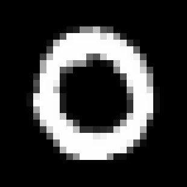
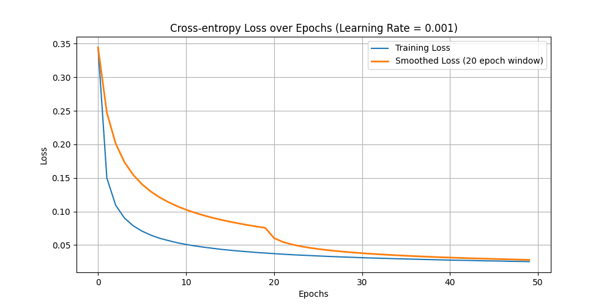
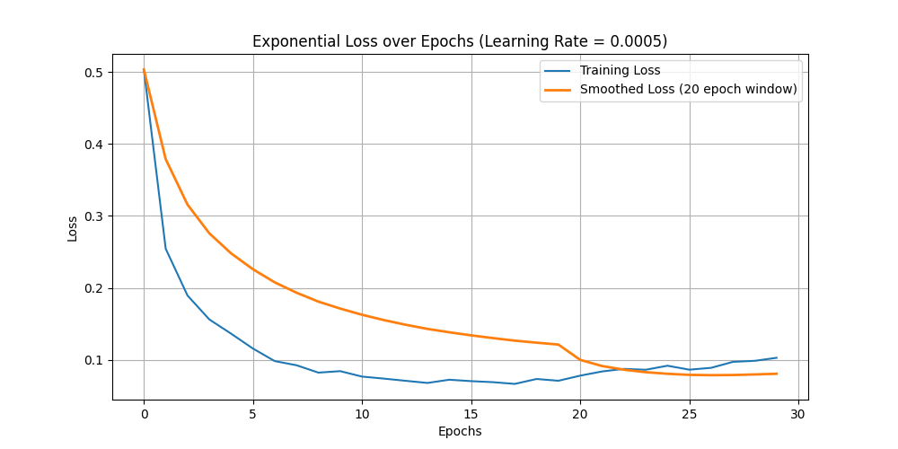

# MNIST Classifier for Digits 0 and 8

This repository contains a Python implementation of a neural network classifier to recognize the digits 0 and 8 from the MNIST dataset. The neural network is implemented using Numpy for the calculations and Matplotlib for loss visualization during training. It uses two different loss functions, Cross-Entropy and Exponential loss.

## Problem Description

The goal of this project is to isolate the numerals 0 and 8 from the MNIST dataset and design a classifier that distinguishes between the two numerals. The network is trained with:

- Cross-Entropy loss
- Exponential loss

The neural network has the following architecture:
- 784 input nodes (one for each pixel in the 28x28 images)
- 300 hidden neurons
- 1 output neuron (binary classification)

## Key Requirements:

**MNIST Dataset**: The dataset contains 5500 images per numeral (digit 0 and digit 8), each of size 28x28 pixels with gray intensity values between 0 and 255.

<p align="center">
  
  
</p>


**Image Preprocessing**: The pixel intensity values are normalized to the range [0,1] by dividing each pixel value by 255.

**Parameter Initialization**: The parameters of the neural network (weights) are initialized as realizations of a Gaussian distribution with mean 0 and variance 1 / (𝑛+𝑚), where n and m are the dimensions of the corresponding weight matrix.

## Neural Network Architecture

### Input Layer
784 neurons (corresponding to the 28x28 pixel values of the images).
### Hidden Layer
300 neurons with ReLU activation function..
### Output Layer 
1 neuron with Sigmoid activation function (binary output indicating whether the image is a 0 or an 8).

### Loss Functions:
**Cross-Entropy Loss**: Used for binary classification tasks and optimized using Stochastic Gradient Descent (SGD).

**Exponential Loss**: An experimental alternative to Cross-Entropy loss.

### Optimization:
The model is trained using Gradient Descent. The gradients are computed and the weights are updated using the ADAM method, which helps achieve uniform convergence during training.

## Features

**Training**: The model is trained using both Cross-Entropy and Exponential loss functions to compare the performance of each method.

**Evaluation**: After training, the model is applied to the test dataset, and error percentages for both digits (0 and 8) are reported.

**Visualization**: Training loss and smoothed loss over epochs are plotted for both loss functions.

**Results**: Error percentages per numeral and the total error percentage are displayed in a table.

## Requirements

To run the project, you need Python 3.x installed and the following Python packages:

- numpy 
- matplotlib
- tensorflow

## How to Use

### 1. Clone the repository:

```
git clone https://github.com/orestis-koutroumpas/Mnist-Classifier.git
```

### 2. Move into directory:

```
cd Mnist-Classifier 
```

### 3. Run the Code:

Execute the Python script to train the model and view the results:

```python mnist_classifier.py```

The script will:

- Load and preprocess the MNIST dataset (only digits 0 and 8).
- Create and train two neural networks, one with Cross-Entropy loss function and the other with Exponential loss function.
- Plot the training loss and smoothed loss over epochs.
- Evaluate the model on the test set and report error rates for digits 0 and 8.

### 3. Example Output:

After running the code, the terminal will show the loss per epoch for each network, and at the end, you'll see the error percentages for both digits:

#### 1. Cross-Entropy Loss over Epochs

This graph shows the progression of the loss for the Cross-Entropy method. The loss decreases as the neural network learns to classify digits 0 and 8.

<p align="center"> 
 
</p>

#### 2. Exponential Loss over Epochs

This graph illustrates the loss progression for the Exponential method. Similar to the Cross-Entropy loss, the Exponential loss decreases over time, suggesting that the model is improving its classification of digits 0 and 8.

<p align="center"> 
 
</p>

#### 3. Terminal Output Example

As the model trains, the terminal will show the following output for each epoch. The loss for each epoch and the smoothed loss will be displayed, helping you track the training progress

```
Epoch 0, Loss: 0.5974, Smoothed Loss: 0.5974
Epoch 1, Loss: 0.5687, Smoothed Loss: 0.5831
...
```

Once training is complete, the error percentages for both digits (0 and 8) will be computed. Here's an example of the final output:

```
Cross-Entropy: Error Percentage for 0 = 0.51 %, Error Percentage for 8 = 0.72 %, Total = 0.61 %
Exponential: Error Percentage for 0 = 1.22 %, Error Percentage for 8 = 0.72 %, Total = 0.97%
```
